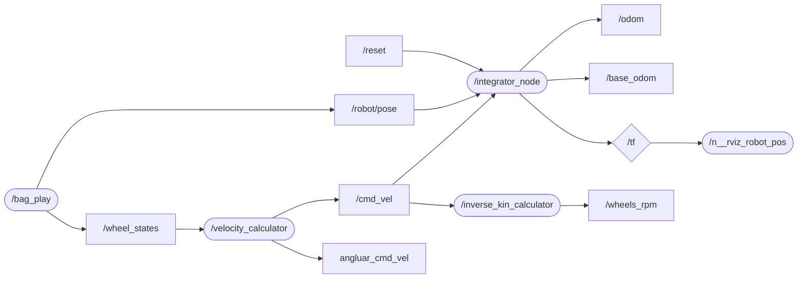

# Project 1

## Students' ID
- 10660258 (Rogora Matteo)
- 10660259 (Grazzani Davide)

---
## Usage
`roslaunch project1 project1.launch bag:=[absolute path to bag]` to start the project\
More informations about starting on chapter *How to start-using nodes*
## Content packages and files description
- `geometry` contains a bunch of libraries to performs most commmon mathematical operations relaed to the project:
    - `matrix` contains many matrix arithmetic operations (sum, multiplication, etc.)
    - `speed_calculator` contains function s to perform continue or discrete direct kinematic computation
- `proj_const` contains definition of functions to load values into the program (such as kinematic matrices initialisation, loading ros parameters, etc.)
- `velocity` performs velocity computation from the wheels velocity
- `integrator`
    - `integrator_node` performs the following operatoins:
        - velocity integration
        - base odometry initialization from ROSBag
        - relative robot position computation
        - tf-broadcasting
        - hosts the dynamic reconfigure server to select the integration method
        - hosts the service server to reset base odometry
    - `reset_client` client to reset odometry to a given position
- `inverse_rpm` performs inverse kinematic computation to check verify operation correctness
- `project1` top-level package, only contains the project's launchfile

---

## ROS parameters:
`par_wheel_radius`: the robot wheel radius
`par_robot_length`: the robot's lenght (wheel-to-wheel)
`par_robot_width`: the robot's width (wheel-to-wheel)
`par_cpr`: wheel encoder revoulution (count per revolution)
`par_gear_ratio`: fixed gear ratio

---

## TF tree structure:


---

## Custom messages and services:

- **inverse_rpm** uses the custom message `Wheels_Rpm` that contains:
    - an `header` to describe message info
    - 4 `float64` values that represent the wheels' velocity in *radiant/minutes*

- **integrator** uses the custom message `Odom_Reset` that contains:
    - A request composed of
        - 3 `float64` values to specify the position to reset the odometry to
        - a `bool` value to specify the method to reset the odometry (if false set the odometry to the specified position, if true set te odometry to the current robot's position)
    - A single `int64` value as response that contains the message return code

## How to start-using nodes
- **velocity**: starts the velocity computation node
```
rosrun velocity velocity_calculator
``` 

- **integrator**: starts the integrator node (`GT_noise_filter` is an integer to specify how many GT samples to read and average to get rid of the noise during base_position evaluation)
```
rosrun integrator integrator_node <GT_noise_filter>
```

- **inverse_rpm**: starts the inverse kinematic's computation node (optional: `sliding_window_size` specifies the size of a sliding window to average the output noise)
```
rosrun inverse_rpm inverse_kin [sliding_window_size]
```

- **odometry reset client**: asks the integrator node to reset odometry to a specified position (if `x`, `y` and `theta` are not specified reset odometry to current robot position)
```
rosrun integrator reset_client [x y theta]
```

- to start the whole project using a ROSBag
```
roslaunch project1 project1.launch bag:=/full/path/to/the/rosbag
```

---

## Additional infos

### World frame
The `integrator_node` uses the first values of the `/robot/pose` topic to determine the initial position of the robot, this is often not a good measure

### Nodes and topics tree


