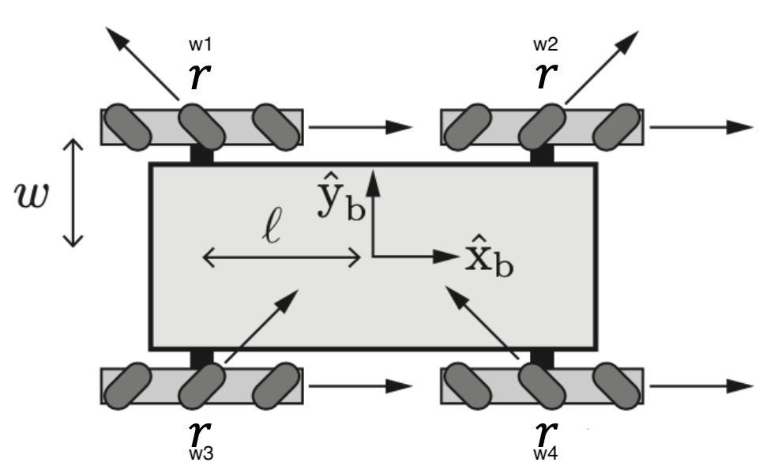

# Project 1 - Robotics A.Y. 2021/22 - Grazzani, Rogora

Some variables notation :\
$r =$ wheel radius\
$\pm l =$ wheel position along $x$\
$\pm w = $ wheel position along $y$\
$T =$ gear ratio\
$N =$ Ticks per revolution

Giver robot parameters 
Parameter | Value
:-:|-
$r$ | $0.07 $ m
$l$ | $0.200$ m
$w$ | $0.169$ m
$T$ | $5:1  $

---

## Wheel velocity equation

4 Mechanum wheels behave like 4 omni-directional wheels perpendicular one another\
We set\
$\omega_m$ angular velocity of the mechanum wheel\
$r_m$ radius of mechanum wheel\
$\omega_o$ angular velocity of the omni-directional wheel\
$r_o$ radius of the omni-directional wheel\

With the notation defined upper we can define\
$\omega_m r_m = \sin\left(\frac\pi{4}\right) \omega_o r_o \Rightarrow \omega_m r_m = \frac {\sqrt 2} 2 \omega_o r_o$\
with $r_o = r_m = r$

We also set positive angular velocity as an actuator is rotating clockwise\
The below image is used to determine wheels number\

Kinematic matrix will be:

$$
\left[\begin{array}{}
v_x\\
v_y\\
\dot\theta
\end{array}\right]
=
A
\left[\begin{array}{}
\omega^o_1\\
\omega^o_2\\
\omega^o_3\\
\omega^o_4
\end{array}\right]
$$
